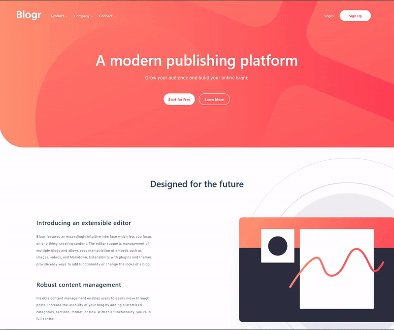

# Frontend Mentor - Blogr landing page solution

This is a solution to the [Blogr landing page challenge on Frontend Mentor](https://www.frontendmentor.io/challenges/blogr-landing-page-EX2RLAApP).

## Table of contents

- [Overview](#overview)
  - [The challenge](#the-challenge)
  - [Screenshot](#screenshot)
- [My process](#my-process)
  - [Built with](#built-with)
  - [What I learned](#what-i-learned)


## Overview

### The challenge

Users should be able to:

- View the optimal layout for the site depending on their device's screen size
- See hover states for all interactive elements on the page

### Screenshot
- Desktop View:<br/>
<br/><br/>
- Mobile View:<br/>


## My process

### Built with

- Semantic HTML5 markup
- [Tailwind CSS](https://tailwindcss.com/) - CSS framework
- CSS custom properties
- VanillaJS 

### What I learned

I was intrigued by the "hype" around Tailwind CSS. So I had to have a look and try it out.<br/>
Once more thank you to Frontend Mentor for providing those challanges, which are perfect opportunities to me for trying out frontend technologies.<br/>
Besides Tailwind I used a little bit of VanillaJS in this project to see how Tailwind can be integrated into a responsive design.<br/>
Using Tailwind CSS was pretty straight forward. The given classes made it really comfortable and I was able to finish the layout quickly.<br/>
Also customizing the Tailwind project was an uncompicated task. Though I do understand the criticism that html files are getting crowded by all the Tailwind classes.<br/>
In combination with a component based frontend framework like Vue or React this drawback might not be as noticable.<br/>
So in my next project I will further explore Tailwind together with a one of the mentioned frameworks.

To run this project use:
```js
npm run dev
```
**Note: As a development server I used the live server extension for VS Code**